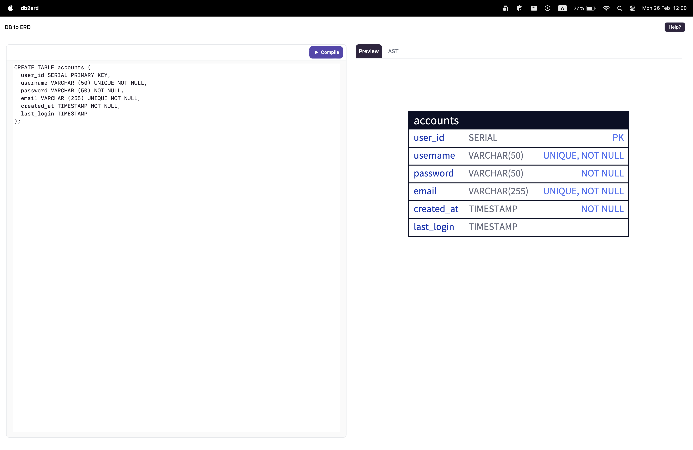

<h1 align="center">DB2ERD</h1>

Database to ER diagram (DB2ERD) is a desktop app that converts `SQL CREATE` statements into `ER` diagram using [d2lang](https://d2lang.com/tour/sql-tables/) for generating the diagram and [Dioxus](https://dioxuslabs.com)(Rust crossplatform app development library) for bundling the desktop app.

> This is still a work in progress, but it is possible to generate `d2` diagrams with the app as it is.

## Requirements
This app assumes that you have already installed `D2` locally. Find more about the installation [here](https://d2lang.com/tour/install).

To check that your local installation is working correctly, run:
```bash
d2 version
```

## Build
This is currently a desktop-only app.

Clone the project and run the following command
```bash
cd /project_directory
cargo run
```